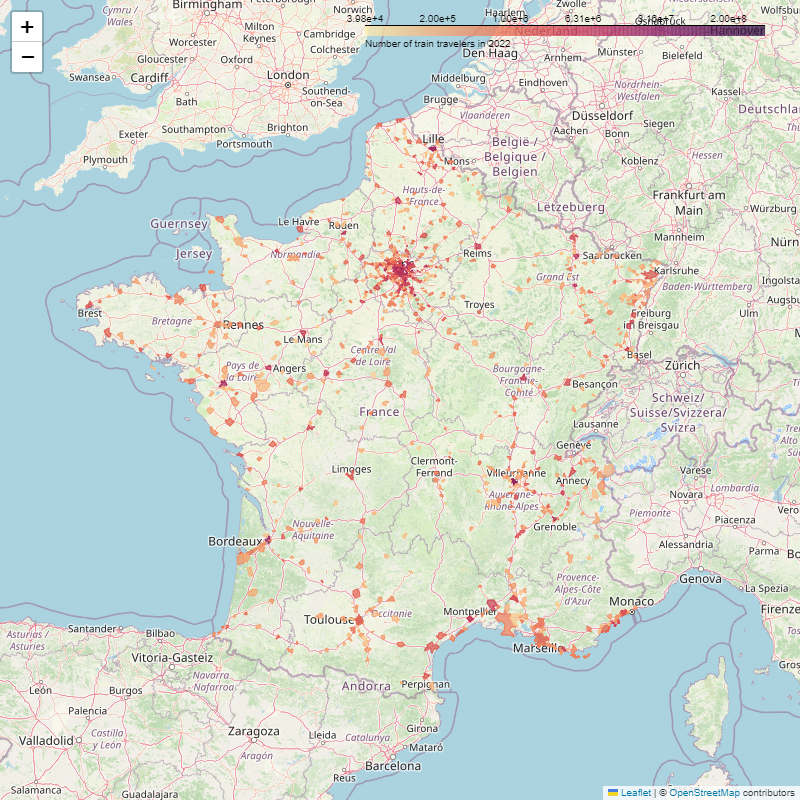

# Notebook projects

## Introduction
I love data. I love it even more when it is open and analyzed.
This repository is my playground where I make various analyses and vizualisations that I find across the Internet.

I share my favorite vizualisations in this homepage but there is much more to discover in the notebooks.

## Main open-data sources
## Mini projects highlights
### French sport memberships

### Train travelers in French cities

## Open datasets used
## Python dependencies
